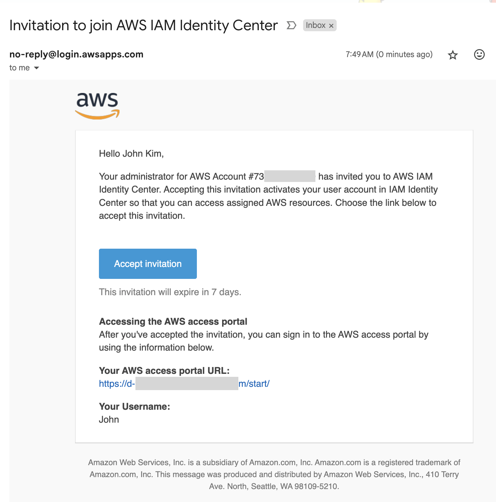

# 실습 2. Amazon Q Business 를 이용한 RAG 실습

Amazon Q Business를 이용해서 RAG를 구현하는 실습을 진행하기 위해 Amazon Q Business 애플리케이션을 생성해보도록 하겠습니다.

## 2.1 Amazon Q Business 애플리케이션 생성

1. 웹 브라우저에서 Amazon Q Business 콘솔 페이지를 엽니다.
2. 이 실습은 us-west-2 (Oregon) 리전을 사용하므로 리전 정보가 올바르게 설정되어 있는지 확인하시기 바랍니다.

[Amazon Q Business 콘솔(us-west-2)](https://us-west-2.console.aws.amazon.com/amazonq/business/applications?region=us-west-2)

3. Amazon Q Business 콘솔에서 Get Started 를 클릭합니다.

4. Create application 을 클릭합니다.

6. Application name 항목에 MyQBizApp 이라고 입력하거나 미리 생성된 추천 이름을 사용해도 됩니다.

7. Access management method 를 AWS IAM Identity Center(recommended)로 둡니다.

9. Create 를 선택합니다. 다음과 같이 애플리케이션이 생성된 것을 확인할 수 있습니다.

## 2.2 사용자 생성하기

1. 만들어진 Amazon Q Business 애플리케이션 화면에서 User access 섹션의 Manage user access 를 클릭합니다.

2. Add groups and users 를 클릭합니다.

3. Add and assign new users 를 선택하고, Next 를 클릭합니다.

4. 다음 화면에서 Add new users 를 클릭합니다.

5. 여러분의 이름과 사용하시는 메일주소를 입력하고 Next 를 클릭합니다. 
예에서는 John Kim 이라는 이름을 사용했습니다. 실습을 위해서 AWS 계정으로 사용하지 않는 개인 메일 주소를 사용하시기를 권장합니다.

6. 다음화면에서 Add를 누르고 Assign 을 클릭합니다.

7. 입력하신 메일주소의 메일함에서 AWS IAM Identity Center로 초대 메일을 확인하고 메일 내용 중에 Accept Invitation 을 클릭합니다.

8. AWS에 로그인시 사용할 암호를 입력하고 새 암호 설정을 클릭합니다.
(8~64자, 대문자 및 소문자, 숫자, 영숫자 이외의 특수문자 포함)

10.  계정이 생성된 후 보여지는 로그인 페이지를 닫습니다. 

## 2.3 Amazon Q Business App 접속하기

1. 브라우저에서 앞에서 생성한 Q Business Application 페이지로 이동합니다.

2. Web experience settings에 Deployed URL 값을 확인합니다.
이 URL을 이용해서 Amazon Q Business 앱에 접속할 수 있으며 채팅을 시작할 수 있습니다.

3. Deployed URL을 클릭합니다.

4. 로그인 창에서 앞서 2.2에서 생성한 사용자 이름과 비밀번호를 입력해서 로그인합니다.

5. 보안을 위해 기본적으로 모든 사용자 로그인에 멀티팩터인증(MFA)을 사용하도록 되어 있습니다.
이 중에서 인증 앱을 선택하고 Next 를 클릭합니다.

6. MFA 인증앱(Authy, Duo Mobile, Microsoft Autenticator, Google Authenticator 등)을 사용할 수 있습니다. 이미 핸드폰에 설치된 MFA 인증앱을 사용하실 수 있습니다.
   
7. Show QR code 를 클릭하고 핸드폰의 MFA 인증앱으로 화면을 스캔합니다.

8. 인증앱에서 보여지는 Authenticator 코드를 입력하고 'MFA 할당'을 클릭합니다.

9. 인증앱이 등록되었으면 '완료'를 클릭합니다.

10. MFA 앱에 보여지는 코드를 이용해서 로그인을 합니다.

11. 다음과 같이 AWS 액세스 포털에 앞에서 성생한 Q Business App이 목록에 보여집니다. 애플리케이션 이름을 클릭합니다. 

12. Amazon Q Business 애플리케이션 화면을 볼 수 있습니다. 채팅창에 프롬프트를 입력하면 Q가 응답합니다.

Amazon Q Business 에 오신 것을 환영합니다.

~~~
한글 프롬프트 입력을 이해하면 한글로 응답할 수도 있습니다.
하지만 실습을 진행 중인 현 시점에서 Amazon Q Business는 아직 공식적으로는 다국어 지원을 하지 않고 영어만 지원하고 있습니다. 
~~~

다음은 Q 애플리케이션에서 결과 응답시 사용할 데이터를 추가해보겠습니다.
