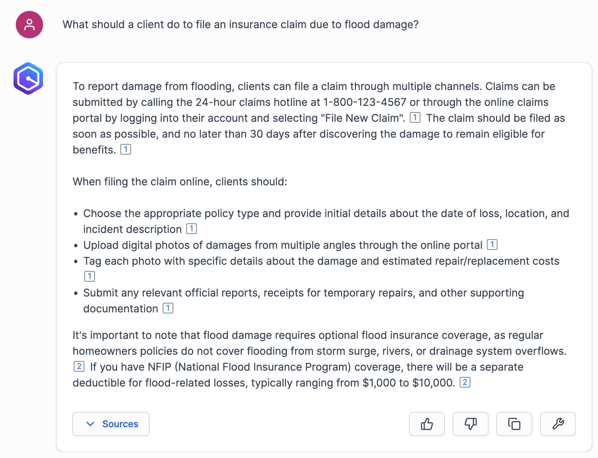

# 실습 2. 문서 파일 업로드 실습

이 실습에서는 앞에서 만든 Amazon Q Business 애플리케이션에 문서 파일을 업로드해서 RAG를 구현하는 예를 실습해보겠습니다.

## 2.1 Upload Files Connector 이용하기

1. 아래 샘플 문서들을 여러분의 컴퓨터에 다운로드 합니다. 
아래 링크를 오른쪽 마우스 버튼을 클릭하고 여러분 컴퓨터의 문서 폴더에 저장합니다.
(예를 들어, Chrome 브라우저를 사용하는 경우 Save Link As... 를 이용해서 저장합니다.)

이 문서들은 가상의 보험회사가 제공하는 HTML 페이지입니다.

[InsuranceIndex](https://static.us-east-1.prod.workshops.aws/public/cafbc4e1-15bf-4df1-add1-e1d15948d360/static/0_InsuranceIndex.html) 

[Auto_Insurance](https://static.us-east-1.prod.workshops.aws/public/cafbc4e1-15bf-4df1-add1-e1d15948d360/static/1_Auto_Insurance.html) 

[Claims_Handling](https://static.us-east-1.prod.workshops.aws/public/cafbc4e1-15bf-4df1-add1-e1d15948d360/static/2_Claims_Handling.html) 

[Claims](https://static.us-east-1.prod.workshops.aws/public/cafbc4e1-15bf-4df1-add1-e1d15948d360/static/3_Claims.html) 

[Hurricane_and_Flood](https://static.us-east-1.prod.workshops.aws/public/cafbc4e1-15bf-4df1-add1-e1d15948d360/static/4_Hurricane_and_Flood.html)

[Policy_Types](https://static.us-east-1.prod.workshops.aws/public/cafbc4e1-15bf-4df1-add1-e1d15948d360/static/5_Policy_Types.html)

2. 다음은  빅데이터 기술에 대하여 PDF 형식으로 제공되는 기술 문서입니다. 
앞에서와 동일한 방법으로 링크를 오른쪽 마우스 버튼으로 클릭해서 문서 폴더에 저장합니다.

[Big Data_Overview](https://static.us-east-1.prod.workshops.aws/public/cafbc4e1-15bf-4df1-add1-e1d15948d360/static/Big%20Data_Overview.pdf)

[Big Data_BigDataandDataWarehouse](https://static.us-east-1.prod.workshops.aws/public/cafbc4e1-15bf-4df1-add1-e1d15948d360/static/Big%20Data_BigDataandDataWarehouse.pdf)

3. 앞에서 생성한 Amazon Q Business 애플리케이션 화면에서 **Data sources** 를 클릭합니다.

4. 아직 생성된 인덱스가 없습니다. 인덱스를 생성하기 위해 **Add an index** 를 클릭합니다.
   

5. 기본값을 이용해서 인덱스를 생성하도록 하겠습니다. 화면에서 **Add an index** 를 클릭합니다.
 

6. 인덱스가 생성되는데 시간이  수 분이 소요될 수 있습니다.

7. 인덱스가 생성되었으면 **Add data source**를 클릭하고 **Upload files**를 클릭합니다.
    

8. **Add File Uploader** 화면에서, **Choose files** 버튼을 클릭합니다.
 

9. 앞서에서 다운로드한 HTML 파일들을 모두 선택하고 Upload를 클릭합니다.
    

10. **Upload** 클릭하면 업로드가 진행된 것을 확인할 수 있습니다.

11. 다시 **Choose files**를 클릭하고, 이번에는 다운로드한 PDF 문서를 선택해서 추가합니다.

12. PDF 문서내에 포함된 컨텐츠를 추출할 수 있도록,
**Advanced Indexing** 아래에 있는 **Visual content in documents** 를 체크한 후에 **Upload**를 클릭합니다.

13. 업로드가 완료되면 **Done** 을 클릭합니다.

14. Amazon Q 애플리케이션에서 사용할 수 있도록 업로드된 문서에 대해 인덱싱 작업이 진행됩니다. 이 과정은 수 분이 소요됩니다. 

15. 브라우저를 새로 고침해보면 Status Details 가 Read to use a source라고 표시되면 인덱싱 작업이 완료된 것입니다.

**Note** 인덱싱 작업이 진행되는 동안 워크샵 진행 안내에 따르시기 바랍니다. 
실습 상황에 따라서 쉬는 시간으로 활용되거나 또는 별도의 기술 설명이 진행될 수 있습니다.

## 2.2 Q Business 애플리케이션 이용하기

1. Web Experience 탭의 Deployed URL을 클릭하여 생성한 Q 애플리케이션으로 접속합니다. 

2. 다음과 같은 프롬프트를 입력해서 결과를 확인합니다.

~~~
What should a client do to file an insurance claim due to flood damage?
~~~

3. **Sources** 를 클릭해서 결과를 생성하는데 참조된 문서 목록을 확인할 수 있습니다.

4. 응답 결과에서 숫자를 클릭하면 해당 결과를 생성하는데 참조된 문서 부분을 확인할 수 있습니다.

5. 동일한 방식으로 다음과 같은 프롬프트를 입력해서 결과를 확인해봅니다.

~~~
How soon should it be filed for hurricane damage?
~~~

~~~
Write an email to the client with a summary of this conversation
~~~

6. 그 외 업로드한 HTML 문서 내용과 관련된 프롬프트를 자유롭게 직접 입력해서 결과를 확인해봅니다.

 
 
 
