## 실습 3. 웹 크롤러를 이용한 Amazon Q Business 실습

이 실습에서는 앞에서 만든 Amazon Q Business 애플리케이션에서 웹 크롤링을 이용해서 RAG를 구현하는 예를 실습해보겠습니다.

# 3.1 Web Crawler Connector 이용하기

1. 생성한 Q Business 애플리케이션에서 **Add Data sources** 버튼을 클릭합니다.

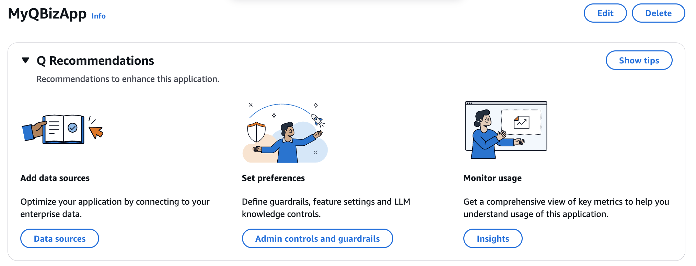
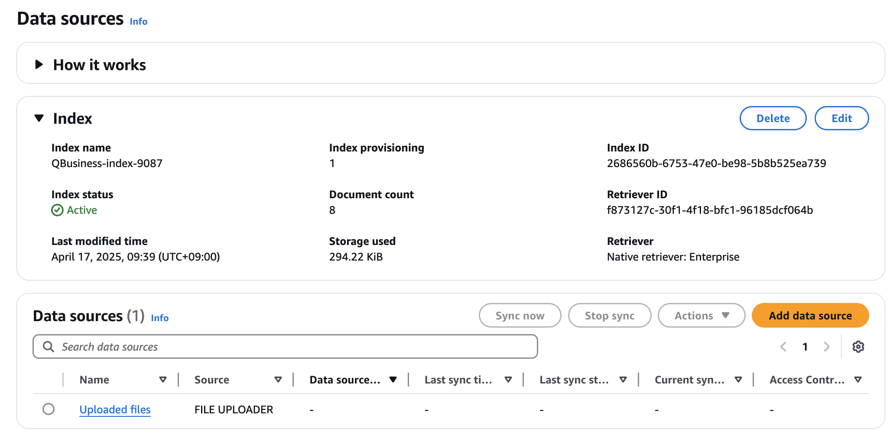

2. Web crawler 를 선택합니다.

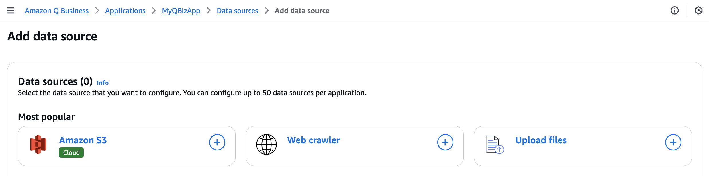

3. **Data source name** 에 'webcrawler' 라고 입력합니다.

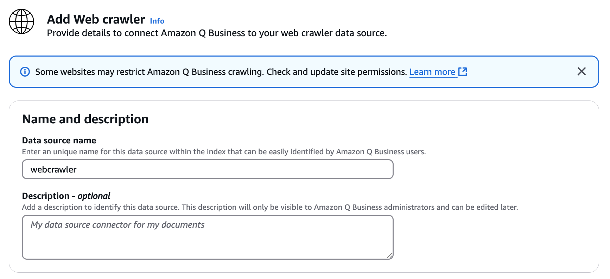

4. 다음 URL 들을 추가하고 **Add Source URLs** 를 클릭합니다.

<li>https://docs.aws.amazon.com/bedrock/latest/userguide/agents.html
<li>https://web.archive.org/web/20241228201821/https://en.wikipedia.org/wiki/Yosemite_National_Park
<li>https://web.archive.org/web/20241219112953/https://en.wikipedia.org/wiki/List_of_James_Bond_films
<li>https://en.wikipedia.org/wiki/List_of_Marvel_Cinematic_Universe_films
<li>https://en.wikipedia.org/wiki/List_of_best-selling_fiction_authors

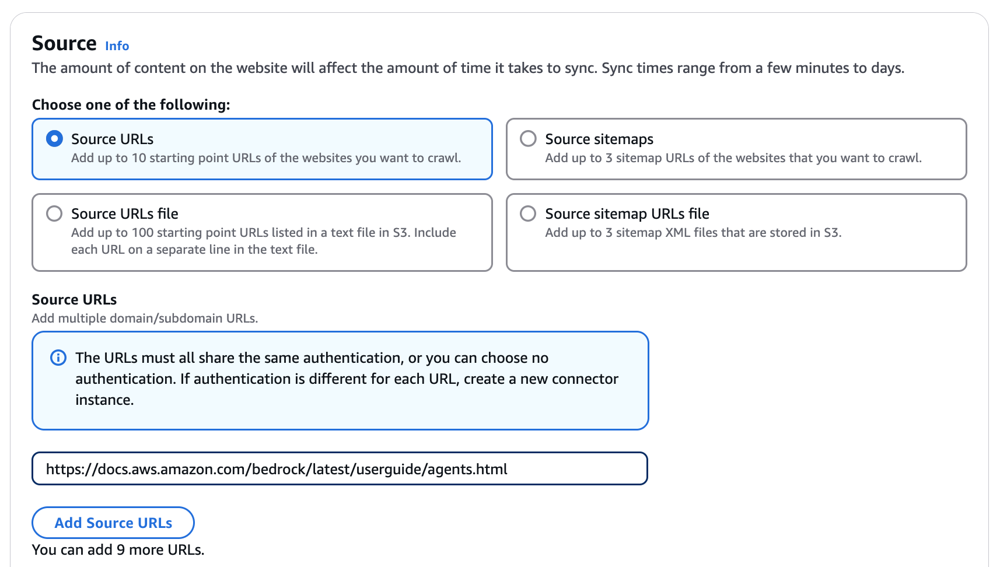

5. Authentication 섹션 및 Web proxy 설정은 기본값으로 둡니다.

6. **IAM role** 을 선택하고, **Create a new service role(Recommended)** 을 선택합니다.

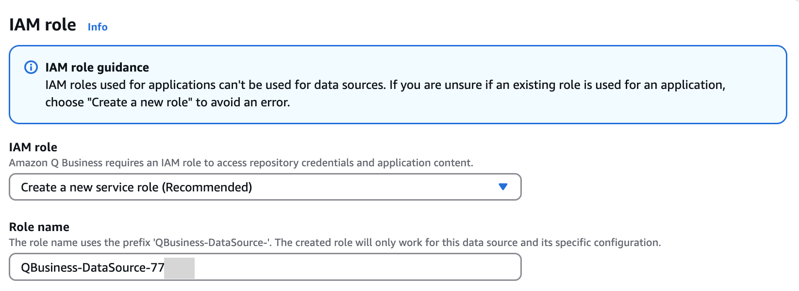
  
6. **Sync scope** 섹션 항목들을 다음과 같이 설정합니다.
- Sync range : Sync domains with subdomains only
- Crawl depth : 0 
- Maximum links per page : 1

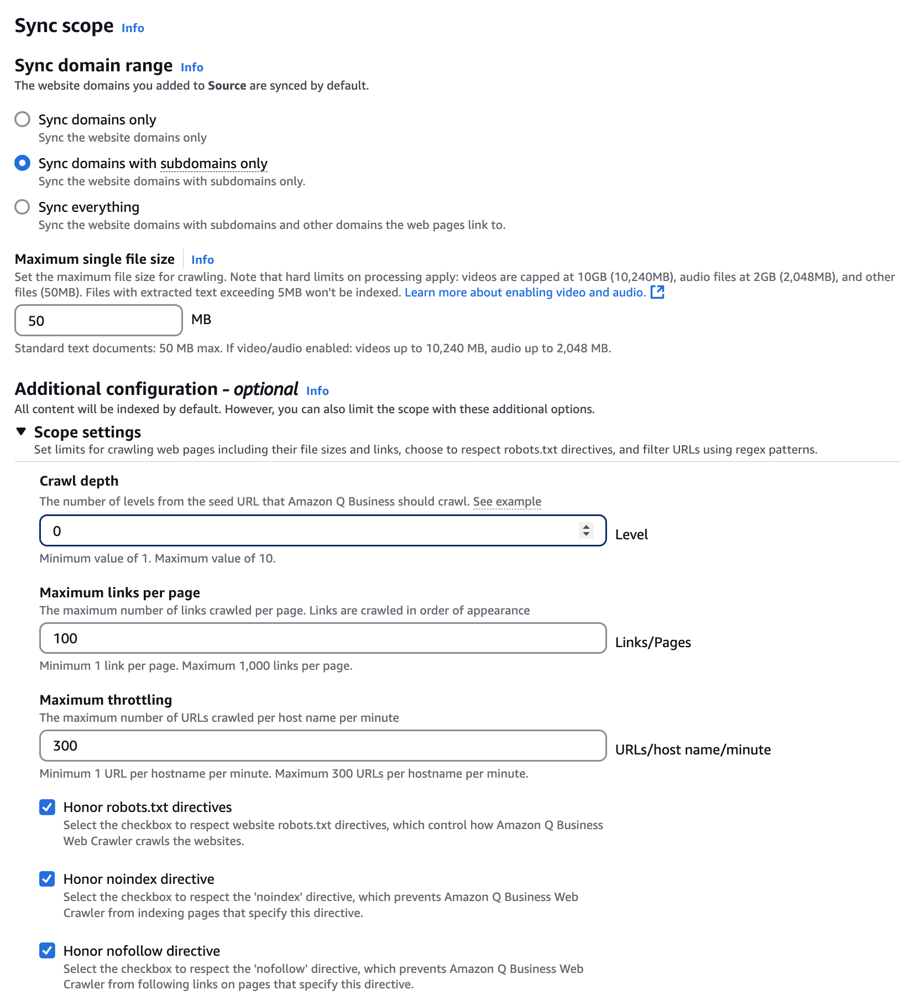

7. **Sync run schedule** 섹션의 항목에서 **Frequency** 를 'Run on demand'로 설정합니다.

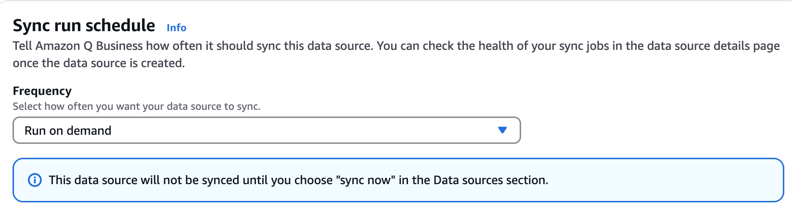

8. 페이지 하단의 **Add data source**를 클릭합니다.

9. Sync now를 선택해서 웹 크롤링으로 인덱싱을 시작합니다. 
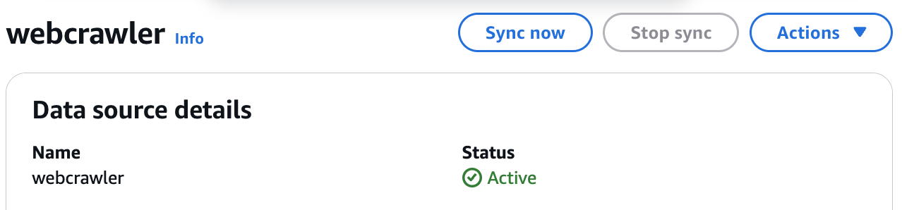

10. Amazon Q Application에서 사용할 수 있도록 인덱싱 작업이 진행됩니다. 이 과정은 10-15 분이 소요됩니다. 

11. 브라우저를 새로 고침해보면 Status Details 가 Read to use a source라고 표시되면 인덱싱 작업이 준비된 것입니다.

인덱싱 작업이 완료될 때까지 잠시 기다립니다. 

인덱싱 작업이 진행되는 동안 워크샵 진행 안내에 따르시기 바랍니다. 
실습 상황에 따라서 쉬는 시간으로 활용되거나 또는 별도의 기술 설명이 진행될 수 있습니다.

# 3.2 Amazon Q Business 애플리케이션 이용하기

1. 생성한 Q Business 애플리케이션의 **Deployed URL** 을 이용해서 애플리케이션에 접속합니다. 

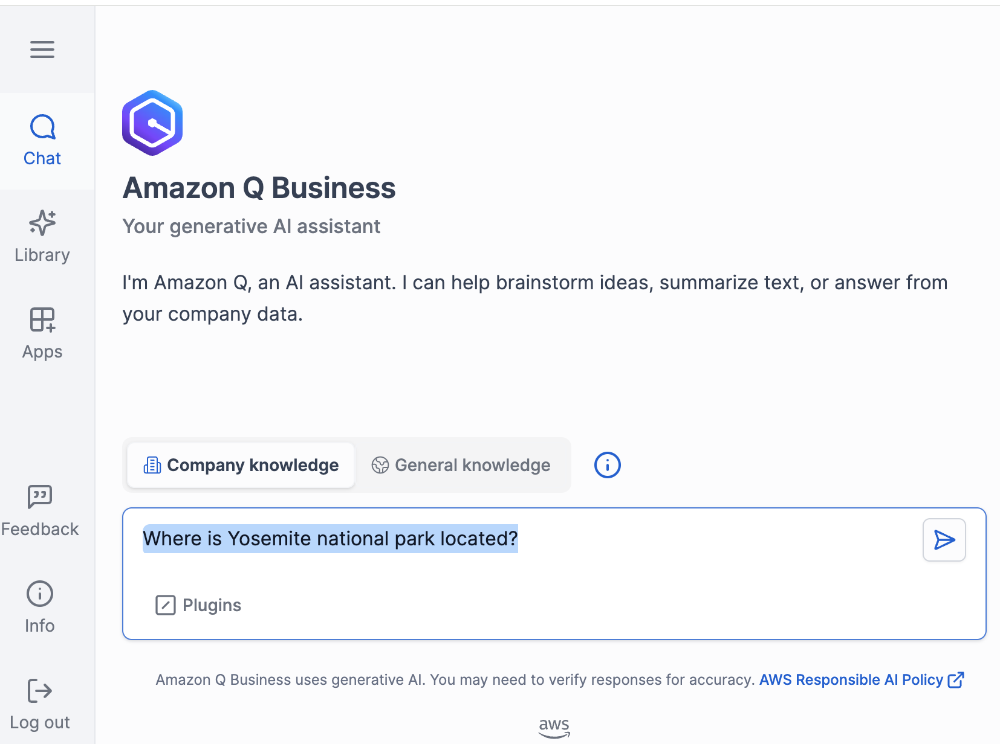

2. 크롤링한 웹 페이지의 내용에 대해 문의하기 위해 다음과 같은 프롬프트를 입력하고 결과를 확인합니다.

~~~
Where is Yosemite national park located?
~~~

~~~
When was it founded?
~~~

~~~
What are the important points to see there?
~~~

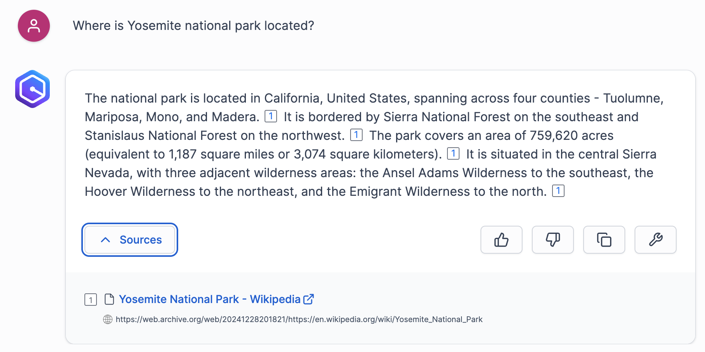

3. 추가적으로 다음과 같은 프롬프트를 입력하고 결과를 확인해봅니다.

~~~
Whats the best time to visit Yosemite?
~~~

~~~
What are the flora and fauna found there?
~~~

~~~
Create a flyer for Yosemite visitors based on this conversation
~~~

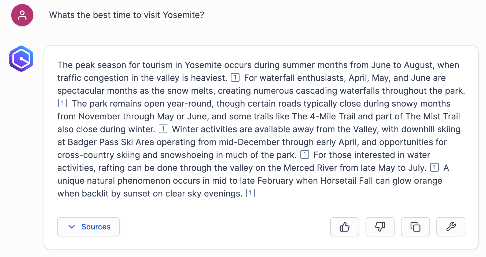

4. 그 외에도 웹 크롤링으로 추가한 문서 페이지 내용을 프롬프트를 이용해서 입력해보시기 바랍니다.
(예: 마블 유니버스 영화, 제임스본드 영화 목록, Bedrock Agents 에 대한 기술 문의)

~~~
Tell me about MCU
~~~

~~~
Who is the producer of the movie Black Widow?
~~~

 
 

Amazon Q Business 애플리케이션에서 Upload files, Web crawler를 이용한 RAG 예제를 실습하였습니다.
수고 많으셨습니다!

 
 
 
